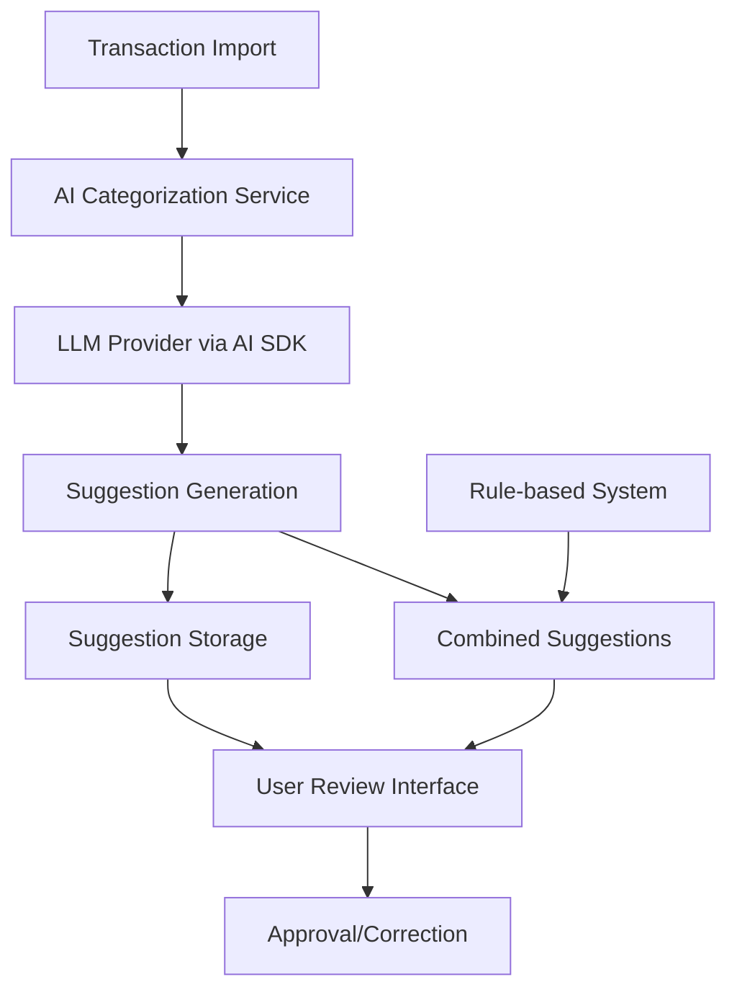

# Design Document

## Overview

The AI Auto-Categorizer leverages the Vercel AI SDK to provide intelligent transaction categorization suggestions using Large Language Models (LLMs). The system analyzes transaction descriptions, amounts, dates, and historical patterns to generate categorization suggestions that users can review and approve through a human-in-the-loop interface.

The design integrates seamlessly with the existing rule-based categorization system, providing AI-powered suggestions when rules don't match or as an additional option alongside rule-based suggestions.

## Architecture

### High-Level Architecture



### Component Integration

The AI categorizer integrates with existing systems:

- **Transaction Processing Pipeline**: Hooks into transaction page and transaction processing flow
- **Suggestion System**: Extends the current suggestion infrastructure used by rule-based categorization. We will have both suggestions - by rule and by AI.
- **Database Layer**: Utilizes existing Prisma models with minimal extensions
- **UI Components**: Reuses existing suggestion review components with AI-specific enhancements

## Components and Interfaces

### 1. AI Categorization Service (`lib/ai/categorization-service.ts`)

Core service responsible for generating AI-powered categorization suggestions.

```typescript
interface AICategorization Service {
  generateSuggestion(transaction: ProcessedTransaction): Promise<AISuggestion>
  generateBulkSuggestions(transactions: ProcessedTransaction[]): Promise<AISuggestion[]>
}

```

### 2. LLM Integration Layer (`lib/ai/llm-client.ts`)

Handles communication with LLM providers through the AI SDK.

```typescript
interface LLMClient {
  categorizeTransaction(
    context: TransactionContext
  ): Promise<CategorySuggestion>;
  categorizeTransactionsBatch(
    contexts: TransactionContext[]
  ): Promise<CategorySuggestion[]>;
}

interface TransactionContext {
  description: string;
  amount: number;
  date: Date;
  accountType: string;
  availableCategories: Category[];
  availableProperties: Property[];
}

interface CategorySuggestion {
  categoryId: string;
  propertyId?: string;
  reasoning: string;
  confidence?: number; // Optional for future use
}
```

### AI Output Format

The AI must return responses in this specific JSON format:

```json
{
  "suggestion": {
    "categoryId": "string",
    "categoryName": "string",
    "propertyId": "string", // Optional - property ID if applicable
    "propertyCode": "string", // Optional - property code if applicable
    "reasoning": "string"
  },
  "metadata": {
    "processingTime": "number",
    "modelUsed": "string"
  }
}
```

**Example Response:**

```json
{
  "suggestion": {
    "categoryId": "cat_123",
    "categoryName": "Condomínios",
    "propertyId": "prop_456",
    "propertyCode": "CAT - Rua Brasil 123",
    "reasoning": "Transaction description 'CONDOMINIO ED BRASIL' indicates a condominium payment for the property at Rua Brasil, categorized under property expenses."
  },
  "metadata": {
    "processingTime": 1250,
    "modelUsed": "gpt-5-mini"
  }
}
```

### 3. Enhanced Suggestion Interface

The existing `TransactionSuggestion` model will be extended to support AI suggestions alongside rule-based suggestions.

```typescript
// AI suggestions will be differentiated from rule-based suggestions
// We'll track the source and metadata separately
interface AISuggestionData {
  processedTransactionId: string;
  suggestedCategoryId: string;
  suggestedPropertyId?: string;
  confidence: number;
  reasoning: string;
  metadata: {
    modelUsed: string;
    processingTime: number;
    tokensUsed?: number;
  };
}
```

## Data Models

### Database Integration Approach

The AI categorizer will use the existing `TransactionSuggestion` model. Since AI suggestions don't have a rule, we'll need to handle them separately:

1. **TransactionSuggestion Table**:

   - AI suggestions will be stored alongside rule-based suggestions
   - The `ruleId` field will be handled differently for AI suggestions
   - Both `suggestedCategoryId` and `suggestedPropertyId` are supported
   - The `confidence` field stores AI confidence scores

2. **Separate AI Suggestion Tracking**:
   - Store AI metadata (model, reasoning, processing time) in a separate service layer
   - Track AI suggestions vs rule-based suggestions through application logic
   - Display different icons in UI based on suggestion source

```typescript
// Example: Creating an AI suggestion
// Since TransactionSuggestion requires a ruleId, we'll need to
// either create a placeholder rule or modify the handling
const aiSuggestion = {
  processedTransactionId: transaction.id,
  suggestedCategoryId: aiResponse.categoryId,
  suggestedPropertyId: aiResponse.propertyId, // Optional
  confidence: aiResponse.confidence || 0.8,
  // Handle ruleId requirement - to be determined based on schema constraints
};
```

## Error Handling

### LLM Provider Failures

- **Fallback Strategy**: When AI SDK fails, gracefully fall back to rule-based suggestions only
- **Retry Logic**: Implement exponential backoff for transient failures
- **Rate Limiting**: Handle API rate limits with queuing and delayed processing

### Data Validation

- **Input Sanitization**: Clean transaction descriptions before sending to LLM
- **Output Validation**: Ensure suggested categories exist and are valid
- **Malformed Responses**: Handle cases where LLM returns unexpected formats

### Error Recovery

```typescript
interface ErrorHandling {
  handleLLMFailure(
    error: Error,
    transaction: ProcessedTransaction
  ): Promise<Suggestion[]>;
  handleRateLimitExceeded(transactions: ProcessedTransaction[]): Promise<void>;
  validateSuggestion(suggestion: CategorySuggestion): boolean;
}
```

## Implementation Approach

### Phase 1: Core AI Integration

1. Set up AI SDK with OpenAI provider
2. Implement basic LLM client for single transaction categorization
3. Create AI categorization service with simple prompting
4. Implement AI suggestion storage strategy alongside existing TransactionSuggestion model

### Phase 2: User Interface Integration

1. Modify existing suggestion components to display AI suggestions
2. AI Suggestions must have a different icon from regular suggestions.
3. Add reasoning display for AI suggestions
4. Implement approval/rejection tracking
5. Create combined view for rule + AI suggestions

### Optimization Strategies

- **Batch Processing**: Process multiple transactions in single LLM calls when possible

# Prompt

```
const systemPrompt = `Você é um assistente especializado em categorizar transações financeiras de uma imobiliária.

CATEGORIAS DISPONÍVEIS:
${categorias.map(c => `- ${c.id}: ${c.name}`).join('\n')}

PROPRIEDADES DISPONÍVEIS:
${propriedades.map(p => `- ID: ${p.id} | Código: ${p.code} | ${p.address}`).join('\n')}

TRANSAÇÕES ANTERIORES SIMILARES:
${historico.slice(-10).map(h =>
 `- "${h.description}" → Categoria: ${h.categoryName}${h.propertyCode ? `, Propriedade: ${h.propertyCode}` : ''}`
).join('\n')}

TRANSAÇÕES PARA CATEGORIZAR:
${transacoes.map((t, index) => `
[${index + 1}]
Descrição: ${t.description}
Valor: R$ ${t.amount}
Data: ${t.date}
Conta Bancária: ${t.bankAccount}
`).join('\n')}

INSTRUÇÕES:

1. Identifique a categoria mais apropriada baseando-se na descrição
2. Se a transação se refere a uma propriedade específica, identifique-a pelo código ou endereço mencionado
3. Transações de aluguel, condomínio e IPTU DEVEM OBRIGATORIAMENTE ter uma propriedade associada
4. Despesas administrativas gerais podem não ter propriedade específica
5. Use o histórico como referência para padrões similares

Retorne APENAS um JSON válido com um array contendo a categorização de CADA transação na mesma ordem:
[
{
"suggestion": {
"categoryId": "id_da_categoria",
"categoryName": "nome_da_categoria",
"propertyId": "id_da_propriedade_ou_null",
"propertyCode": "codigo_da_propriedade_ou_null",
"reasoning": "breve explicação da categorização"
},
"metadata": {
"processingTime": 0,
"modelUsed": "gpt-5-mini"
}
}
]`;
```
