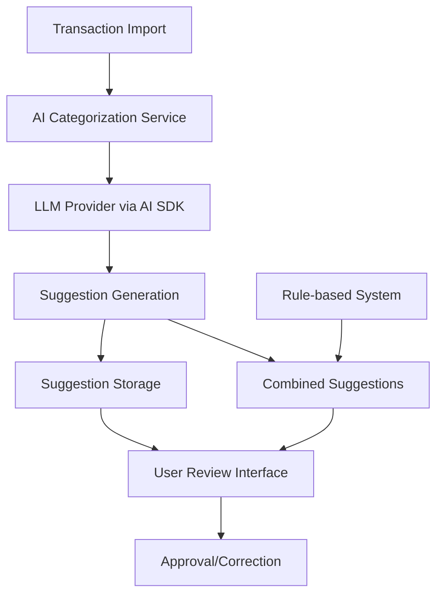

# Design Document

## Overview

The AI Auto-Categorizer leverages the Vercel AI SDK to provide intelligent transaction categorization suggestions using Large Language Models (LLMs). The system analyzes transaction descriptions, amounts, dates, and historical patterns to generate categorization suggestions that users can review and approve through a human-in-the-loop interface.

The design integrates seamlessly with the existing rule-based categorization system, providing AI-powered suggestions when rules don't match or as an additional option alongside rule-based suggestions.

## Architecture

### High-Level Architecture



### Component Integration

The AI categorizer integrates with existing systems:

- **Transaction Processing Pipeline**: Hooks into transaction page and transaction processing flow
- **Suggestion System**: Extends the current suggestion infrastructure used by rule-based categorization. We will have both suggestions - by rule and by AI.
- **Database Layer**: Utilizes existing Prisma models with minimal extensions
- **UI Components**: Reuses existing suggestion review components with AI-specific enhancements

## Components and Interfaces

### 1. AI Categorization Service (`lib/ai/categorization-service.ts`)

Core service responsible for generating AI-powered categorization suggestions.

```typescript
interface AICategorization Service {
  generateSuggestion(transaction: ProcessedTransaction): Promise<AISuggestion>
  generateBulkSuggestions(transactions: ProcessedTransaction[]): Promise<AISuggestion[]>
}

interface AISuggestion {
  id: string
  transactionId: string
  suggestedCategoryId: string
  reasoning: string
  source: 'ai'
  createdAt: Date
}
```

### 2. LLM Integration Layer (`lib/ai/llm-client.ts`)

Handles communication with LLM providers through the AI SDK.

```typescript
interface LLMClient {
  categorizeTransaction(
    context: TransactionContext
  ): Promise<CategorySuggestion>;
  categorizeTransactionsBatch(
    contexts: TransactionContext[]
  ): Promise<CategorySuggestion[]>;
}

interface TransactionContext {
  description: string;
  amount: number;
  date: Date;
  accountType: string;
  availableCategories: Category[];
}

interface CategorySuggestion {
  categoryId: string;
  reasoning: string;
  confidence?: number; // Optional for future use
}
```

### AI Output Format

The AI must return responses in this specific JSON format:

```json
{
  "suggestion": {
    "categoryId": "string",
    "categoryName": "string",
    "reasoning": "string"
  },
  "metadata": {
    "processingTime": "number",
    "modelUsed": "string"
  }
}
```

**Example Response:**

```json
{
  "suggestion": {
    "categoryId": "cat_123",
    "categoryName": "Alimentação",
    "reasoning": "Transaction description 'SUPERMERCADO XYZ' indicates a grocery store purchase, which falls under the food/grocery category."
  },
  "metadata": {
    "processingTime": 1250,
    "modelUsed": "gpt-4"
  }
}
```

### 3. Enhanced Suggestion Interface

Extends existing suggestion components to handle AI suggestions.

```typescript
interface EnhancedSuggestion extends Suggestion {
  source: 'rule' | 'ai';
  reasoning?: string;
  aiMetadata?: {
    modelUsed: string;
    processingTime: number;
    tokensUsed: number;
  };
}
```

## Data Models

### Database Schema Extensions

Minimal extensions to existing Prisma schema:

```prisma
model Suggestion {
  id          String   @id @default(cuid())
  transactionId String
  categoryId  String
  source      SuggestionSource @default(RULE)
  reasoning   String?
  confidence  Float?
  metadata    Json?
  createdAt   DateTime @default(now())
  updatedAt   DateTime @updatedAt

  transaction ProcessedTransaction @relation(fields: [transactionId], references: [id])
  category    Category @relation(fields: [categoryId], references: [id])

  @@map("suggestions")
}

enum SuggestionSource {
  RULE
  AI
}


```

## Error Handling

### LLM Provider Failures

- **Fallback Strategy**: When AI SDK fails, gracefully fall back to rule-based suggestions only
- **Retry Logic**: Implement exponential backoff for transient failures
- **Rate Limiting**: Handle API rate limits with queuing and delayed processing

### Data Validation

- **Input Sanitization**: Clean transaction descriptions before sending to LLM
- **Output Validation**: Ensure suggested categories exist and are valid
- **Malformed Responses**: Handle cases where LLM returns unexpected formats

### Error Recovery

```typescript
interface ErrorHandling {
  handleLLMFailure(
    error: Error,
    transaction: ProcessedTransaction
  ): Promise<Suggestion[]>;
  handleRateLimitExceeded(transactions: ProcessedTransaction[]): Promise<void>;
  validateSuggestion(suggestion: CategorySuggestion): boolean;
}
```

## Implementation Approach

### Phase 1: Core AI Integration

1. Set up AI SDK with OpenAI provider
2. Implement basic LLM client for single transaction categorization
3. Create AI categorization service with simple prompting
4. Extend suggestion model to support AI source

### Phase 2: User Interface Integration

1. Modify existing suggestion components to display AI suggestions
2. Add reasoning display for AI suggestions
3. Implement approval/rejection tracking
4. Create combined view for rule + AI suggestions

### Phase 3: Learning System

1. Implement historical pattern storage
2. Add learning from user interactions
3. Enhance prompts with historical context
4. Create batch processing for improved efficiency

### Phase 4: Optimization and Monitoring

1. Add performance monitoring and metrics
2. Implement caching for similar transactions
3. Add configuration options for different LLM providers
4. Create admin interface for AI system insights

## Security Considerations

### Data Privacy

- **Transaction Data**: Ensure transaction descriptions are sanitized before sending to external LLM providers
- **PII Handling**: Implement detection and masking of personally identifiable information
- **Data Retention**: Follow data retention policies for AI learning data

### API Security

- **API Keys**: Secure storage and rotation of LLM provider API keys
- **Rate Limiting**: Implement client-side rate limiting to prevent abuse
- **Request Logging**: Log AI requests for audit and debugging purposes

### Access Control

- **Feature Flags**: Implement feature flags to enable/disable AI suggestions
- **User Permissions**: Respect existing user permissions for category access
- **Audit Trail**: Maintain audit trail of AI suggestions and user interactions

## Performance Considerations

### Optimization Strategies

- **Batch Processing**: Process multiple transactions in single LLM calls when possible
- **Caching**: Cache suggestions for identical transaction descriptions
- **Async Processing**: Process AI suggestions asynchronously to avoid blocking imports
- **Smart Queuing**: Prioritize recent transactions for faster user feedback

### Resource Management

- **Token Usage**: Monitor and optimize LLM token consumption
- **Memory Management**: Efficient handling of large transaction batches
- **Database Optimization**: Index suggestions table for fast retrieval
- **Background Processing**: Use background jobs for learning system updates

## Monitoring and Analytics

### Key Metrics

- **Suggestion Accuracy**: Track approval/rejection rates for AI suggestions
- **Processing Time**: Monitor time taken for suggestion generation
- **Token Usage**: Track LLM API usage and costs
- **User Adoption**: Measure usage of AI vs rule-based suggestions

### Alerting

- **High Error Rates**: Alert when AI suggestion generation fails frequently
- **Performance Degradation**: Monitor response times and alert on slowdowns
- **Cost Monitoring**: Alert when LLM usage exceeds budget thresholds
- **Data Quality**: Monitor for unusual patterns in suggestions or approvals
