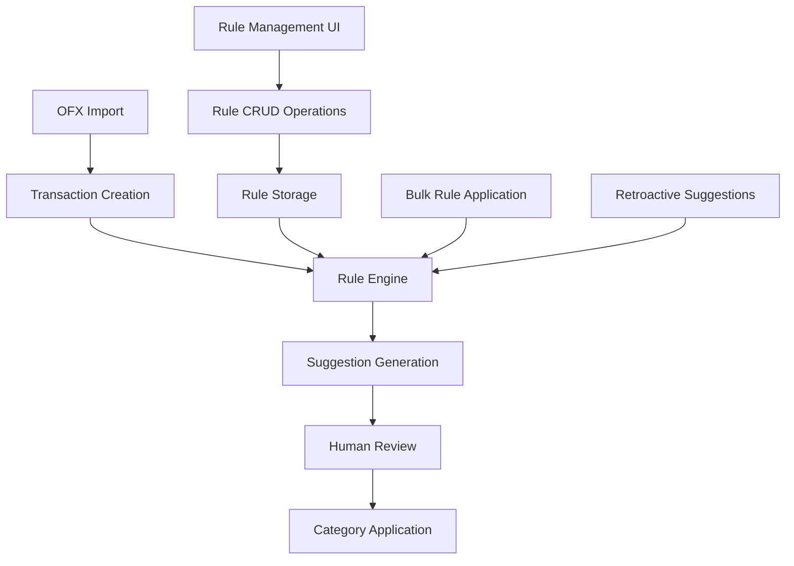

# Design Document

## Overview

The automatic transaction categorization system will provide rule-based suggestions for transaction categorization while maintaining human oversight. The system will integrate seamlessly with the existing `/transacoes` interface, adding rule management capabilities and suggestion workflows without disrupting current functionality.

## Architecture

### High-Level Architecture



### System Components

1. **Rule Engine**: Core logic for evaluating rules against transactions
2. **Rule Management**: CRUD operations for categorization rules
3. **Suggestion System**: Storage and management of rule-generated suggestions
4. **UI Integration**: Enhanced transaction interface with suggestion workflows
5. **Audit System**: Tracking of rule applications and user decisions

## Components and Interfaces

### Database Schema Extensions

#### New Models

```prisma
// Categorization Rules
model CategorizationRule {
  id          String   @id @default(cuid())
  name        String   // User-friendly rule name
  description String?  // Optional rule description
  isActive    Boolean  @default(true)
  priority    Int      @default(0) // Higher number = higher priority

  // Target categorization
  categoryId  String
  category    Category @relation(fields: [categoryId], references: [id])
  propertyId  String?
  property    Property? @relation(fields: [propertyId], references: [id])

  // Rule criteria (JSON type)
  criteria    Json     // { date: {...}, value: {...}, description: {...}, accounts: [...] }

  // Metadata
  createdAt   DateTime @default(now())
  updatedAt   DateTime @updatedAt

  suggestions TransactionSuggestion[]

  @@map("categorization_rules")
}

// Transaction Suggestions
model TransactionSuggestion {
  id                    String                @id @default(cuid())
  processedTransactionId String
  processedTransaction  ProcessedTransaction  @relation(fields: [processedTransactionId], references: [id])

  ruleId                String
  rule                  CategorizationRule    @relation(fields: [ruleId], references: [id])

  suggestedCategoryId   String
  suggestedCategory     Category              @relation(fields: [suggestedCategoryId], references: [id])
  suggestedPropertyId   String?
  suggestedProperty     Property?             @relation(fields: [suggestedPropertyId], references: [id])

  confidence            Float                 @default(1.0) // 0.0 to 1.0
  isApplied             Boolean               @default(false)
  appliedAt             DateTime?

  createdAt             DateTime              @default(now())

  @@unique([processedTransactionId, ruleId])
  @@map("transaction_suggestions")
}
```

#### Schema Updates

```prisma
// Add relation to ProcessedTransaction
model ProcessedTransaction {
  // ... existing fields
  suggestions TransactionSuggestion[]
}

// Add relation to Category
model Category {
  // ... existing fields
  categorizationRules   CategorizationRule[]
  suggestions           TransactionSuggestion[]
}

// Add relation to Property
model Property {
  // ... existing fields
  categorizationRules   CategorizationRule[]
  suggestions           TransactionSuggestion[]
}
```

### Rule Criteria Structure

Rules will store criteria as JSON with the following structure:

```typescript
interface RuleCriteria {
  date?: {
    dayRange?: { start: number; end: number }; // e.g., { start: 1, end: 15 }
    months?: number[]; // e.g., [1, 2, 3] for Jan, Feb, Mar
  };
  value?: {
    min?: number;
    max?: number;
    operator?: 'gt' | 'gte' | 'lt' | 'lte' | 'eq' | 'between';
  };
  description?: {
    keywords: string[];
    operator: 'and' | 'or'; // How to combine keywords
    caseSensitive?: boolean;
  };
  accounts?: string[]; // Bank account IDs
}
```

### Core Services

#### Rule Engine Service

```typescript
// lib/database/rule-engine.ts
export class RuleEngine {
  async evaluateTransaction(
    transaction: ProcessedTransaction,
    rules: CategorizationRule[]
  ): Promise<TransactionSuggestion[]>;

  async generateSuggestions(
    transactionIds: string[],
    ruleIds?: string[]
  ): Promise<void>;

  async applyRuleToTransactions(
    ruleId: string,
    transactionIds: string[]
  ): Promise<TransactionSuggestion[]>;
}
```

#### Rule Management Service

```typescript
// lib/database/rule-management.ts
export interface CreateRuleInput {
  name: string;
  description?: string;
  categoryId: string;
  propertyId?: string;
  criteria: RuleCriteria;
  priority?: number;
}

export async function createRule(
  input: CreateRuleInput
): Promise<CategorizationRule>;
export async function updateRule(
  id: string,
  input: Partial<CreateRuleInput>
): Promise<CategorizationRule>;
export async function deleteRule(id: string): Promise<void>;
export async function getRules(): Promise<CategorizationRule[]>;
export async function testRule(
  ruleId: string,
  limit?: number
): Promise<ProcessedTransaction[]>;
```

#### Suggestion Service

```typescript
// lib/database/suggestions.ts
export async function getSuggestionsForTransaction(
  transactionId: string
): Promise<TransactionSuggestion[]>;

export async function applySuggestion(suggestionId: string): Promise<void>;

export async function applySuggestions(suggestionIds: string[]): Promise<void>;

export async function dismissSuggestion(suggestionId: string): Promise<void>;
```

### Server Actions

#### Rule Management Actions

```typescript
// app/regras-categorizacao/actions.ts
export async function createRuleAction(input: CreateRuleInput);
export async function updateRuleAction(
  id: string,
  input: Partial<CreateRuleInput>
);
export async function deleteRuleAction(id: string);
export async function toggleRuleAction(id: string, isActive: boolean);
export async function testRuleAction(ruleId: string, limit?: number);
```

#### Suggestion Actions

```typescript
// app/transacoes/actions.ts (additions)
export async function generateSuggestionsAction(transactionIds: string[]);
export async function applySuggestionAction(suggestionId: string);
export async function applySuggestionsAction(suggestionIds: string[]);
export async function dismissSuggestionAction(suggestionId: string);
```

## Data Models

### Rule Evaluation Logic

The rule engine will evaluate transactions using the following priority:

1. **Account Filter**: If rule specifies accounts, transaction must be from one of those accounts
2. **Date Criteria**: Check if transaction date matches day range and/or month criteria
3. **Value Criteria**: Check if transaction amount matches value conditions
4. **Description Criteria**: Check if transaction description contains specified keywords

All criteria must match (AND logic) for a rule to generate a suggestion.

### Suggestion Confidence

Suggestions will include a confidence score based on:

- **Exact keyword match**: 1.0
- **Partial keyword match**: 0.8
- **Value range match**: 0.9
- **Date pattern match**: 0.7
- **Combined criteria**: Average of individual scores

### Priority Resolution

When multiple rules match a transaction:

1. Apply rule with highest priority number
2. If priorities are equal, apply most recently created rule
3. Generate only one suggestion per transaction per rule evaluation

## Error Handling

### Rule Validation

- **Criteria Validation**: Ensure JSON criteria is well-formed and contains valid values
- **Category Validation**: Verify target category exists and is active
- **Circular Reference**: Prevent rules that could create infinite loops
- **Performance Limits**: Limit number of keywords and complexity of criteria

### Suggestion Generation

- **Transaction Validation**: Ensure transaction exists and is not already categorized
- **Rule Availability**: Skip inactive or deleted rules
- **Duplicate Prevention**: Don't create duplicate suggestions for same transaction/rule pair
- **Batch Processing**: Handle large batches with proper error isolation

### Error Recovery

- **Partial Failures**: Continue processing other rules/transactions when one fails
- **Rollback Support**: Ability to undo suggestion applications
- **Audit Trail**: Log all rule applications and failures for debugging

## Testing Strategy

### Unit Tests

1. **Rule Engine Tests**

   - Test individual criteria evaluation (date, value, description)
   - Test rule priority resolution
   - Test confidence scoring
   - Test edge cases (null values, invalid data)

2. **Rule Management Tests**

   - Test CRUD operations
   - Test rule validation
   - Test rule activation/deactivation

3. **Suggestion Tests**
   - Test suggestion generation
   - Test suggestion application
   - Test bulk operations

### Integration Tests

1. **End-to-End Workflow**

   - Create rule → Generate suggestions → Apply suggestions
   - Test with real transaction data
   - Test retroactive suggestion generation

2. **UI Integration**

   - Test rule management interface
   - Test suggestion display in transaction table
   - Test bulk suggestion operations

3. **Performance Tests**
   - Test rule evaluation with large transaction sets
   - Test suggestion generation performance
   - Test database query optimization

### Test Data

- **Sample Rules**: Create representative rules for common categorization patterns
- **Test Transactions**: Generate transactions that match and don't match various rule criteria
- **Edge Cases**: Test with unusual transaction descriptions, amounts, and dates

## UI/UX Design

### Rule Management Interface

**New Page**: `/regras-categorizacao`

```
┌─────────────────────────────────────────────────────────────┐
│ Regras de Categorização                          [+ Nova]   │
├─────────────────────────────────────────────────────────────┤
│ ┌─────────────────────────────────────────────────────────┐ │
│ │ 🟢 Aluguel Mensal                    [Editar] [Testar] │ │
│ │ Categoria: Receitas > Aluguel                           │ │
│ │ Propriedade: CAT - Rua Brasil                          │ │
│ │ Critérios: Dia 1-5, Valor > R$ 1.000, "ALUGUEL"      │ │
│ │ Prioridade: 10 | Criada: 15/08/2025                   │ │
│ └─────────────────────────────────────────────────────────┘ │
│ ┌─────────────────────────────────────────────────────────┐ │
│ │ 🔴 Despesas Cartão                   [Editar] [Testar] │ │
│ │ Categoria: Despesas > Cartão de Crédito                │ │
│ │ Propriedade: (nenhuma)                                 │ │
│ │ Critérios: Conta "CC - Sicredi", "CARTAO"             │ │
│ │ Prioridade: 5 | Criada: 14/08/2025                    │ │
│ └─────────────────────────────────────────────────────────┘ │
└─────────────────────────────────────────────────────────────┘
```

### Transaction Table Enhancements

**Enhanced Transaction Row with Suggestions**:

```
┌─────────────────────────────────────────────────────────────┐
│ ☐ 15/08/2025 | ALUGUEL CASA CENTRO | CC-Sicredi | R$ 1.200 │
│   💡 Sugestão: Receitas > Aluguel | CAT - Rua Brasil       │
│   📋 Regra: Aluguel Mensal                                 │
│   [Aplicar] [Descartar] [Editar Manualmente]               │
└─────────────────────────────────────────────────────────────┘
```

**Bulk Actions Enhancement**:

```
┌─────────────────────────────────────────────────────────────┐
│ 15 transações selecionadas                                  │
│ [Gerar Sugestões] [Aplicar Sugestões] [Categorizar]        │
└─────────────────────────────────────────────────────────────┘
```

### Visual Indicators

- **🟢 Green dot**: Active rule
- **🔴 Red dot**: Inactive rule
- **💡 Lightbulb**: Transaction has suggestion
- **✨ Sparkle**: Auto-categorized transaction
- **📝 Note**: Manual categorization
- **⚡ Lightning**: Bulk operation

### Responsive Design

- **Mobile**: Stack rule criteria vertically, simplify bulk actions
- **Tablet**: Two-column rule layout, condensed suggestion display
- **Desktop**: Full feature set with optimal spacing

## Performance Considerations

### Database Optimization

1. **Indexes**

   - `categorization_rules(isActive, priority)`
   - `transaction_suggestions(processedTransactionId, isApplied)`
   - `processed_transactions(categoryId, isReviewed)` (existing)

2. **Query Optimization**

   - Batch rule evaluation to minimize database round trips
   - Use EXISTS queries for suggestion checks
   - Implement pagination for rule testing

3. **Caching Strategy**
   - Cache active rules in memory
   - Cache rule evaluation results for identical transactions
   - Use Redis for suggestion counts and statistics

### Rule Engine Performance

1. **Evaluation Order**

   - Evaluate cheapest criteria first (account, value)
   - Evaluate expensive criteria last (description matching)
   - Short-circuit evaluation when criteria fail

2. **Batch Processing**

   - Process suggestions in batches of 100 transactions
   - Use database transactions for consistency
   - Implement progress tracking for large operations

3. **Memory Management**
   - Stream large result sets instead of loading all into memory
   - Clean up temporary data structures after processing
   - Monitor memory usage during bulk operations

## Security Considerations

### Input Validation

- **Rule Criteria**: Validate JSON structure and data types
- **SQL Injection**: Use parameterized queries for all database operations
- **XSS Prevention**: Sanitize rule names and descriptions for display

### Access Control

- **Rule Management**: Restrict to authorized users only
- **Suggestion Application**: Validate user permissions before applying
- **Audit Logging**: Log all rule changes and suggestion applications

### Data Integrity

- **Transaction Consistency**: Use database transactions for multi-step operations
- **Referential Integrity**: Ensure rules reference valid categories
- **Backup Strategy**: Regular backups before bulk rule applications

## Migration Strategy

### Database Migration

1. **Phase 1**: Create new tables (`categorization_rules`, `transaction_suggestions`)
2. **Phase 2**: Add foreign key relationships
3. **Phase 3**: Create indexes for performance
4. **Phase 4**: Seed with sample rules (optional)

### Feature Rollout

1. **Phase 1**: Rule management interface (create, edit, delete rules)
2. **Phase 2**: Manual suggestion generation (select transactions → generate suggestions)
3. **Phase 3**: Suggestion display and application in transaction table
4. **Phase 4**: Automatic suggestion generation on import
5. **Phase 5**: Bulk operations and advanced features

### Backward Compatibility

- Existing transaction categorization workflow remains unchanged
- New features are additive and optional
- No breaking changes to existing APIs or database schema
- Graceful degradation when suggestion system is unavailable
